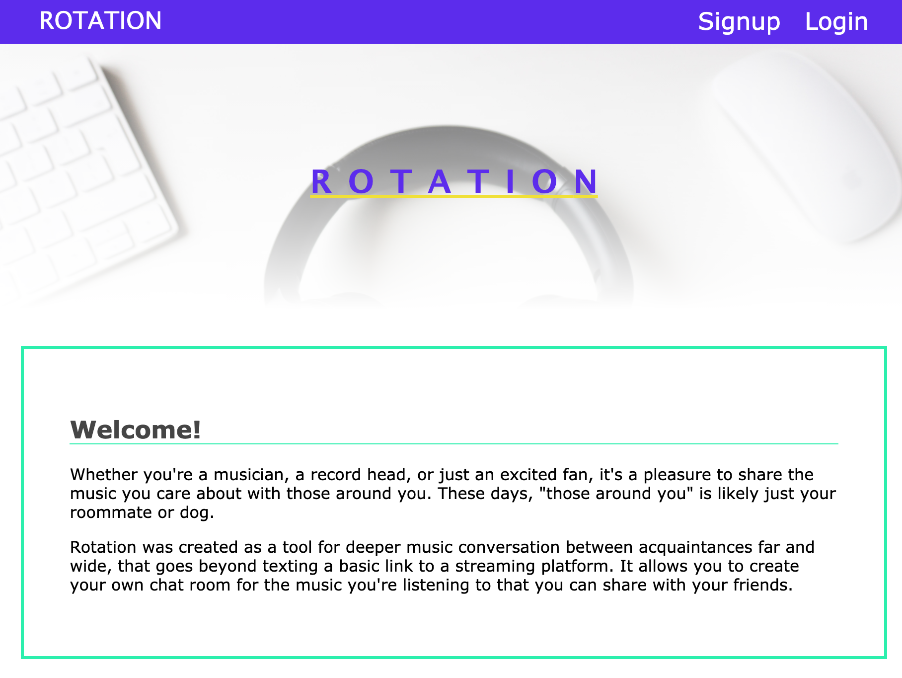
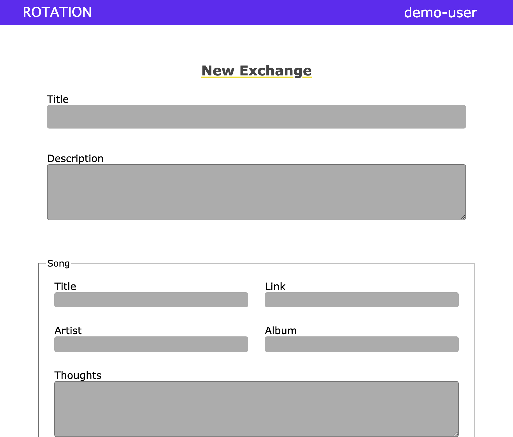
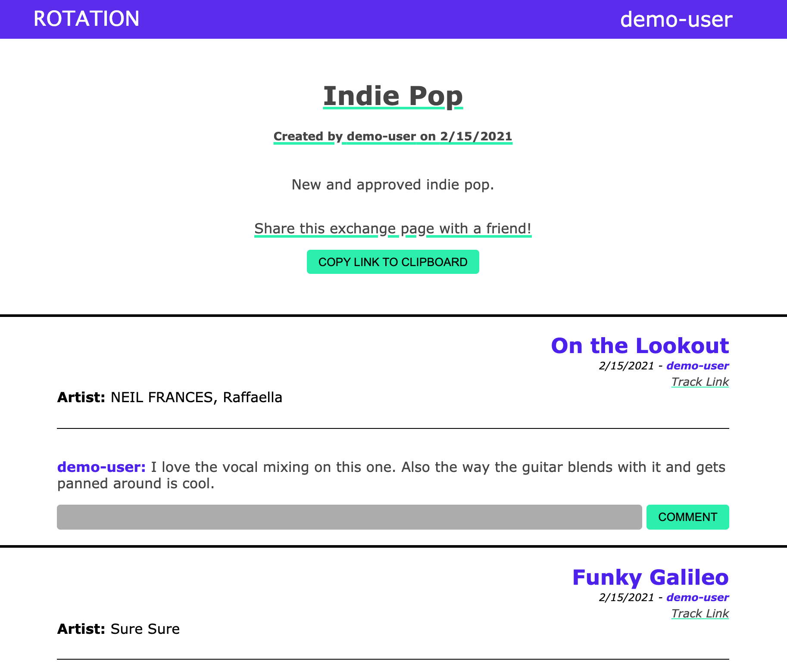
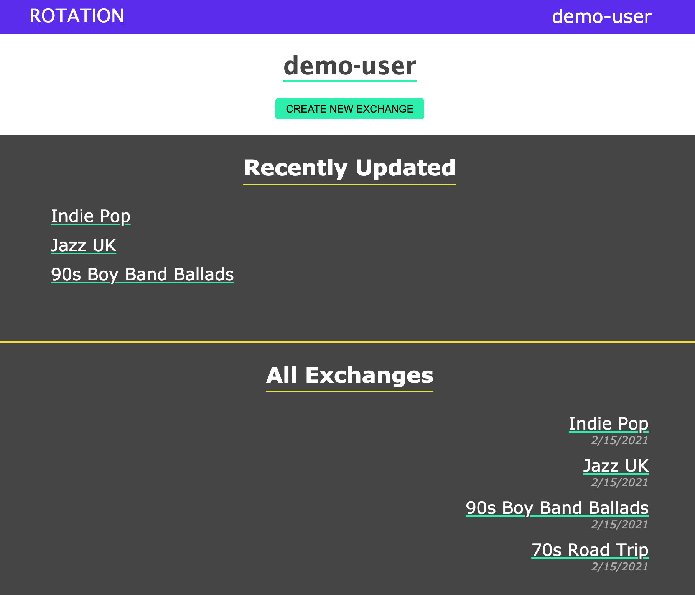

# Rotation API

### Summary
[Live Demo](https://rotationexchange.com/)

API server for [Rotation Client](https://github.com/Tarv44/rotation-client).

This is my first fullstack project that I've built. Rotation allows users to have a common place to share and discuss music, regardless of what streaming platform they use.

### Enpoints:

* GET /users
* POST /users
* POST /users/login
* GET /users/:user_id/exchanges

* POST /exchanges
* GET /exchanges/:exchange_id

* POST /songs

* POST /comments

### Technology used:
* PostgreSQL
* Express
* Node

***

